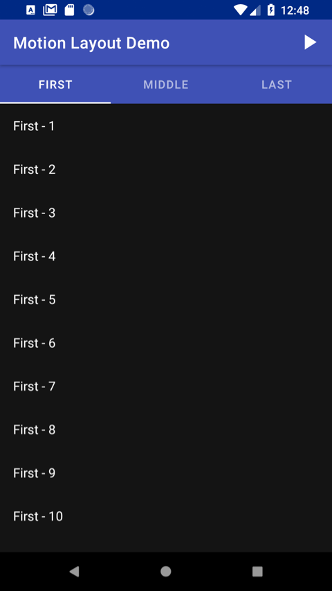
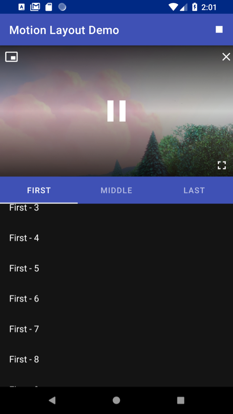
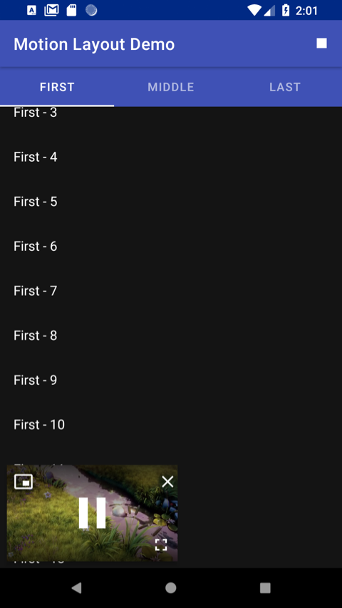
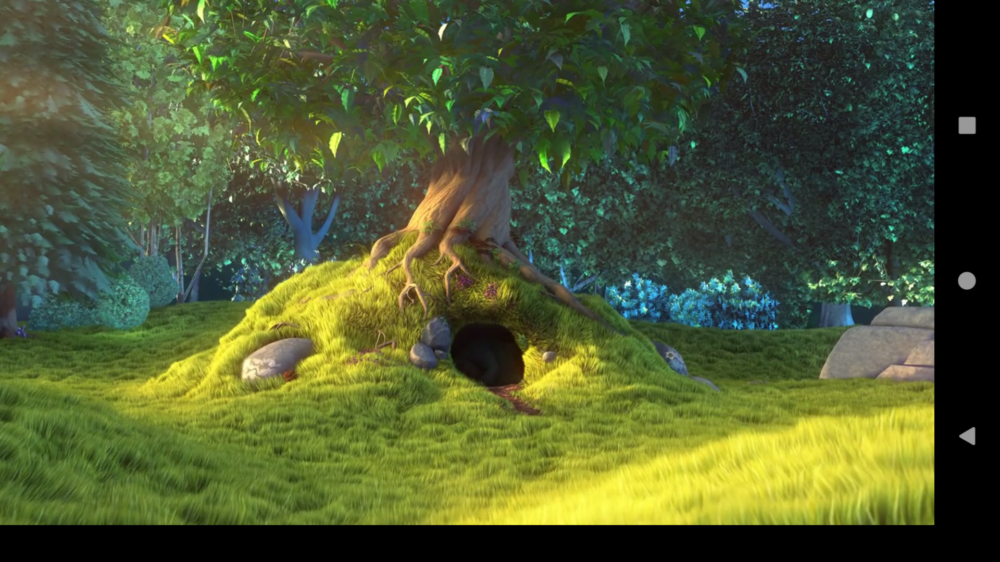

# Motion Layout Video Demo
This is a sample android application that demonstrates using the Android `MotionLayout`
to control a video, and move it between 3 states: Embedded (or inline), Picture-in-Picture (PIP),
and Full Screen. As an added bonus, there is an additional branch that adds dragging and scrolling
to the PIP implementation. 

### Requirements
This demo is based off of a real life application I am working on at my job, and so there are
some functional requirements it adheres to based on the requirements of the business.

- For everything except full screen video, the app is "locked" to portrait mode.
- It's optimized for phones, though it should work well on tablets and larger screens without
much (if any) effort.
- The video should NOT be displayed until the user starts playback. 
- When playback is started, the video should be displayed inline at the top of the 
screen, and the other content should shift down below it, unless...
- If the user has scrolled down in the list, then the video should start in PIP mode.
- The video should have dedicated controls for forcing PIP mode, inline mode, and full screen mode. 
- When full screen mode is enabled, the video should fill the screen, and rotate to landscape view.
- The video should automatically move into and out of full screen mode when the device is rotated.
- When exiting full screen mode the app should "remember" whether or not to return the video to 
PIP or inline mode. 
- When the video is stopped, it should disappear entirely. 
- If the video is stopped and restarted, it should appear in either inline mode or pip
mode, whichever was the last mode used. 
- If the video is stopped in full screen mode, and then restarted, the app should "remember"
the last mode used (inline or pip) and restart the video in that mode.

  
  
  
  

### Dragging and Scrolling
As a bonus, you'll find a `drag-and-scroll` branch in the repo. This adds 2 additional features:
1. While in PIP mode, you can drag the video around on the screen as you please.
2. If you scroll down in the main content list(s) while the the video is playing, it will 
automatically switch to PIP mode. Likewise, if you scroll down and THEN start the video, 
it will start in PIP mode.

#### That's not a standard VideoView, what gives?
This demo uses a custom VideoView widget (`ControlledVideoView`). This was taken from the 
[Google Picure-In-Picture sample app](https://github.com/googlesamples/android-PictureInPicture), 
and modified slightly to fit our needs. It is nearly identical to the standard VideoView, except
that it provides overlay controls for playback and toggling between different states (inline, pip, full screen).

#### How does DragMotionLayout work?
DragMotionLayout is just an extension of MotionLayout which adds support to make one child
view (our video view) draggable by using the [Android ViewDragHelper](https://developer.android.com/reference/android/support/v4/widget/ViewDragHelper). 
The documentation for ViewDragHelper is, uhh ... sparse ... so I found 
[this blog post](http://fedepaol.github.io/blog/2014/09/01/dragging-with-viewdraghelper/) to be quite helpful to get it going.

#### Why use a configuration change to do the rotation for full screen; MotionLayout can handle that, right?
I could've just used `MotionLayout` to rotate the video and make it full screen. However, 
when the device is rotated, the user would expect gestures to be available, like swiping
down from the top to reveal the status bar, etc. If we just rotated the video, this functionality
would not be there, instead they would have to swipe from the side to reveal a (sideways) status bar.

#### Why don't you use Android's built-in Picture-in-Picture support?
For this demo, the requirements for "Picture in Picture" are a bit different
than the functionality that Android provides for it's [Picture in Picture Support](https://developer.android.com/guide/topics/ui/picture-in-picture).
Specifically, Android PIP support is intended for putting an activity in PIP mode when LEAVING,
the task to do something else (either another task within the current application, or 
using another application all together). For this demo, the requirements are to stay on the current
task, and put just the video into PIP mode, so that the other content can fill the screen.

